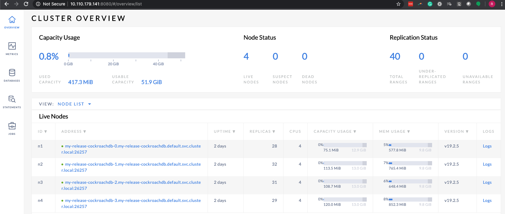
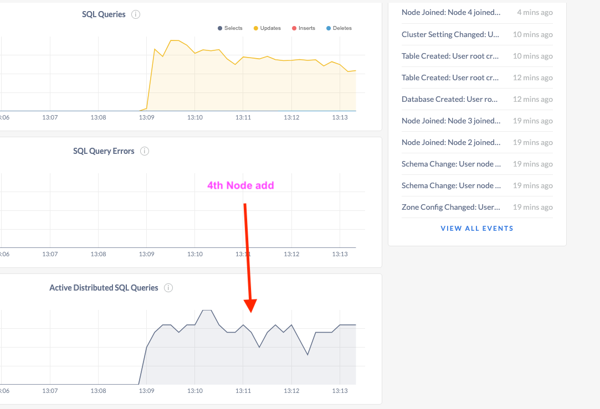
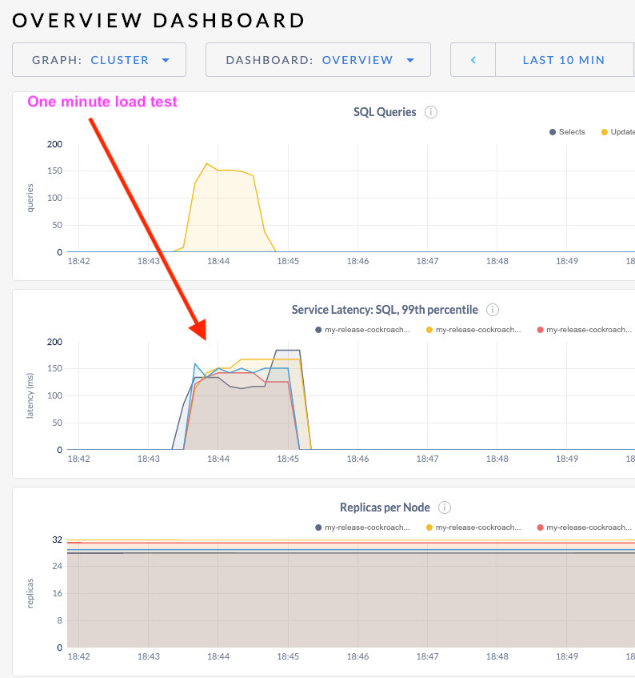
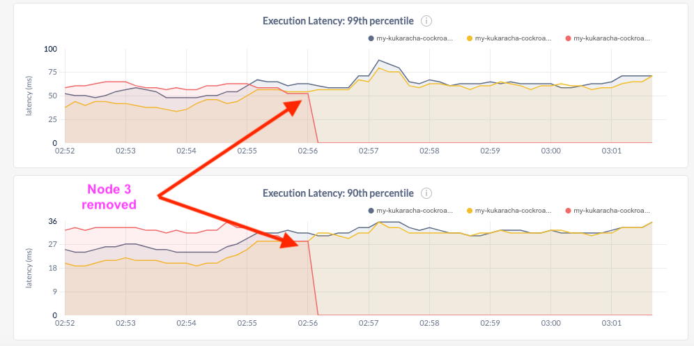
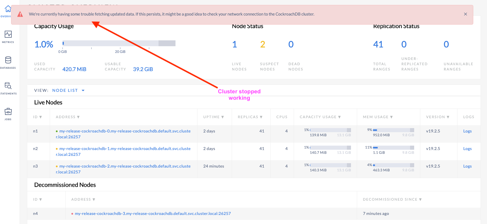

# My experiments with Cockroachdb on Minikube! ::smile

## Launch and Initialize CRDB

## Install Cockroachdb with Helm

```
raj$ helm install my-release stable/cockroachdb
NAME: my-release
LAST DEPLOYED: Thu Apr 23 07:54:05 2020
NAMESPACE: default
STATUS: deployed
REVISION: 1
NOTES:
CockroachDB can be accessed via port 26257 at the
following DNS name from within your cluster:

my-release-cockroachdb-public.default.svc.cluster.local

Because CockroachDB supports the PostgreSQL wire protocol, you can connect to
the cluster using any available PostgreSQL client.

For example, you can open up a SQL shell to the cluster by running:

    kubectl run -it --rm cockroach-client \
        --image=cockroachdb/cockroach \
        --restart=Never \
        --command -- \
        ./cockroach sql --insecure --host=my-release-cockroachdb-public.default

From there, you can interact with the SQL shell as you would any other SQL
shell, confident that any data you write will be safe and available even if
parts of your cluster fail.

Finally, to open up the CockroachDB admin UI, you can port-forward from your
local machine into one of the instances in the cluster:

    kubectl port-forward my-release-cockroachdb-0 8080

Then you can access the admin UI at http://localhost:8080/ in your web browser.

For more information on using CockroachDB, please see the project's docs at:
https://www.cockroachlabs.com/docs/

```

<HR>
  
```
k get po -w
NAME                                READY   STATUS    RESTARTS   AGE
my-release-cockroachdb-0            0/1     Running   0          10s
my-release-cockroachdb-1            0/1     Running   0          10s
my-release-cockroachdb-2            0/1     Running   0          10s
my-release-cockroachdb-init-djjkb   1/1     Running   0          10s
raj$ k get pvc
NAME                               STATUS   VOLUME                                     CAPACITY   ACCESS MODES   STORAGECLASS   AGE
datadir-my-release-cockroachdb-0   Bound    pvc-b87ac1e4-a9f2-458b-acd7-d82eea6b34ca   100Gi      RWO            standard       13m
datadir-my-release-cockroachdb-1   Bound    pvc-c860a4d6-c842-45e4-9f42-9a6eae34a7d2   100Gi      RWO            standard       13m
datadir-my-release-cockroachdb-2   Bound    pvc-645ff5d5-52ec-4f9a-aa05-f1a7a1c02347   100Gi      RWO            standard       13m
```

<HR>
  
Installed Loadbalancer on Minikube with minikube tunnel command. You can see the output from the service list below...

```
NAME                                    TYPE           CLUSTER-IP       EXTERNAL-IP      PORT(S)                          AGE
service/kubernetes                      ClusterIP      10.96.0.1        <none>           443/TCP                          29m
service/my-release-cockroachdb          ClusterIP      None             <none>           26257/TCP,8080/TCP               15m
service/my-release-cockroachdb-public   LoadBalancer   10.110.179.141   10.110.179.141   26257:32319/TCP,8080:30180/TCP   15m

```
## Added a 4th Node as shown below with Kubectl scale command

```
raj$ k scale statefulset.apps/my-release-cockroachdb --replicas=4
statefulset.apps/my-release-cockroachdb scaled

raj$ k get all
NAME                                    READY   STATUS      RESTARTS   AGE
pod/my-release-cockroachdb-0            1/1     Running     0          17m
pod/my-release-cockroachdb-1            1/1     Running     0          17m
pod/my-release-cockroachdb-2            1/1     Running     0          17m
pod/my-release-cockroachdb-3            1/1     Running     0          80s
pod/my-release-cockroachdb-init-djjkb   0/1     Completed   0          17m
pod/workload-run                        1/1     Running     0          2m15s

NAME                                    TYPE           CLUSTER-IP       EXTERNAL-IP      PORT(S)                          AGE
service/kubernetes                      ClusterIP      10.96.0.1        <none>           443/TCP                          30m
service/my-release-cockroachdb          ClusterIP      None             <none>           26257/TCP,8080/TCP               17m
service/my-release-cockroachdb-public   LoadBalancer   10.110.179.141   10.110.179.141   26257:32319/TCP,8080:30180/TCP   17m

NAME                                      READY   AGE
statefulset.apps/my-release-cockroachdb   4/4     17m

NAME                                    COMPLETIONS   DURATION   AGE
job.batch/my-release-cockroachdb-init   1/1           37s        17m

```

<P>
 
<HR>
<P>
    
<HR>
<P>
 
<HR>
<P>

# Generating a Load against the CRDB cluster:

The following is the workload command for a duration of 1 minute againts the bank DB
```
raj$ kubectl run workload-run -it --image=cockroachdb/cockroach:latest --rm --restart=Never -- workload run bank --duration=1m 'postgresql://root@my-release-cockroachdb-public:26257?sslmode=disable&ApplicationName=bank'
If you don't see a command prompt, try pressing enter.
_elapsed___errors__ops/sec(inst)___ops/sec(cum)__p50(ms)__p95(ms)__p99(ms)_pMax(ms)
    1.0s        0          134.3          137.2     29.4    134.2    570.4    637.5 transfer
    2.0s        0          177.0          157.0     39.8     88.1    285.2    637.5 transfer
    3.0s        0          185.9          166.6     39.8     79.7    125.8    226.5 transfer
    4.0s        0          183.9          170.9     44.0     75.5     83.9    167.8 transfer
    5.0s        0          187.1          174.2     39.8     83.9    109.1    142.6 transfer
    6.0s        0          148.8          170.0     44.0    125.8    369.1    402.7 transfer
    7.0s        0          171.1          170.1     39.8     75.5    109.1    335.5 transfer
    8.0s        0          142.0          166.6     46.1    134.2    369.1    419.4 transfer
    9.0s        0          178.0          167.9     41.9     79.7    109.1    159.4 transfer
   10.0s        0          168.0          167.9     39.8    113.2    201.3    285.2 transfer
   11.0s        0          163.0          167.4     41.9    109.1    201.3    260.0 transfer
   12.0s        0          158.9          166.7     46.1     92.3    117.4    268.4 transfer
   13.0s        0          187.1          168.3     41.9     75.5     96.5    151.0 transfer
   14.0s        0          172.1          168.6     44.0     83.9    121.6    167.8 transfer
   15.0s        0          173.8          168.9     41.9     88.1    100.7    176.2 transfer
   16.0s        0          157.2          168.2     50.3     88.1    117.4    226.5 transfer
   17.0s        0          148.7          167.0     50.3     92.3    268.4    335.5 transfer
   18.0s        0          138.2          165.4     52.4    117.4    151.0    209.7 transfer
   19.0s        0          171.1          165.7     41.9     96.5    159.4    201.3 transfer
   20.0s        0          146.9          164.8     48.2    117.4    209.7    234.9 transfer
...
```
<P>
 
<HR>
<P>

Set your load generator to run for at least 60 minutes to give you time to run through
some common scenarios. Here is the command for generating 60m load test on the bank workload.

```
raj$ kubectl run workload-run -it --image=cockroachdb/cockroach:latest --rm --restart=Never -- workload run bank --duration=60m 'postgresql://root@my-release-cockroachdb-public:26257?sslmode=disable&ApplicationName=bank'
If you don't see a command prompt, try pressing enter.
```

# Scaling and Failing

● Attach a 4th node and see how the system behaves (watch for 5 minutes) - See above screenshot and command line used here.
```
kubectl scale statefulset.apps/my-kukaracha-cockroachdb --replicas=4
```

● Gracefully remove a node from the cluster and see how the system behaves (watch for 5
minutes)
Used the decommision command to do this as follows

```
kubectl run cockroachdb -it --image=cockroachdb/cockroach:v19.2.6 --rm --restart=Never -- node decommission 3 --insecure --host=my-kukaracha-cockroachdb-public

```

● Forcibly remove a node from the cluster (think kill -9) and see how the system behaves
(watch for 5 minutes)
Forcibly delete a CRDB pod as shown below.

```
kubectl delete pod/my-kukaracha-cockroachdb-3

```
<P>
 
<HR>
<P>
    
● Remove all nodes but one from the cluster. Decommisioned all the nodes except one and the cluster stops working as expected.

```
kubectl run cockroachdb -it --image=cockroachdb/cockroach:v19.2.6 --rm --restart=Never -- node decommission 3 --insecure --host=my-kukaracha-cockroachdb-public

kubectl run cockroachdb -it --image=cockroachdb/cockroach:v19.2.6 --rm --restart=Never -- node decommission 2 --insecure --host=my-kukaracha-cockroachdb-public

```
<P>
 
<HR>
<P>
